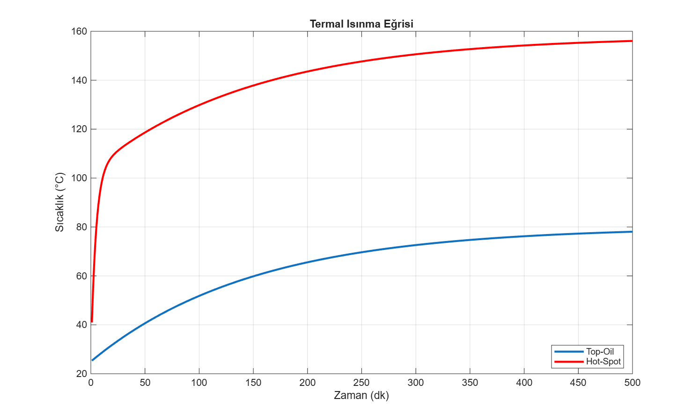

# Fluxion - Comprehensive Digital Twin Technical Report

This automated report is generated by the Fluxion Digital Twin engine. It contains physical, thermal, chemical, and economic evaluations of the transformer.

## 1. Transformer Nameplate & Base Parameters
- **Nominal Power:** 50.00 MVA
- **Voltage (Primary / Secondary):** 154.00 kV / 34.50 kV
- **No-Load Loss (Core):** 42.00 kW
- **Load Loss (Copper):** 265.00 kW
- **Equivalent Impedance (Zeq):** 0.1250 pu

## 2. Inrush & Transients Analysis
A Monte Carlo simulation was executed with 20 closing angle variations to determine the worst-case energization transients.
- **Absolute Maximum Inrush Current:** 15500.46 A (58.47 pu)

## 3. Thermal Analysis & Expected Life (RUL)
The thermal dynamic model conforms to IEC 60076-7, estimating top-oil and winding hot-spot temperatures.
- **Top-Oil Steady-State:** 79.9 °C
- **Hot-Spot Steady-State:** 102.9 °C

## 4. Chemical Diagnosis: Dissolved Gas Analysis (DGA)
Gas concentrations provided via config/sensors are mapped to the **Duval Triangle 1 (IEC 60599)**.
- **Methane (CH4):** 120.0 ppm
- **Ethylene (C2H4):** 30.0 ppm
- **Acetylene (C2H2):** 15.0 ppm
- **Diagnosis:** D1 (Low Energy Discharge)

## 5. Economic & Cost Efficiency Analysis
- **Total Losses at Nominal Load:** 307.0 kW
- **Daily Wasted Energy Cost:** $884.16
- **Annual Operating Cost (Losses):** $322718

---
*Report dynamically generated by Fluxion.*
